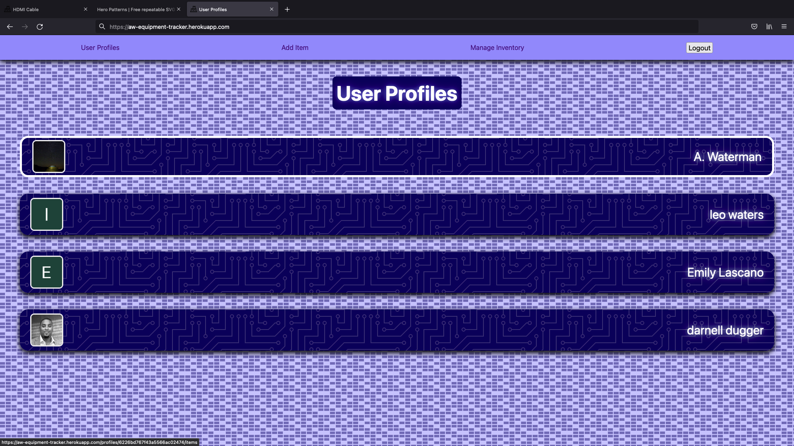
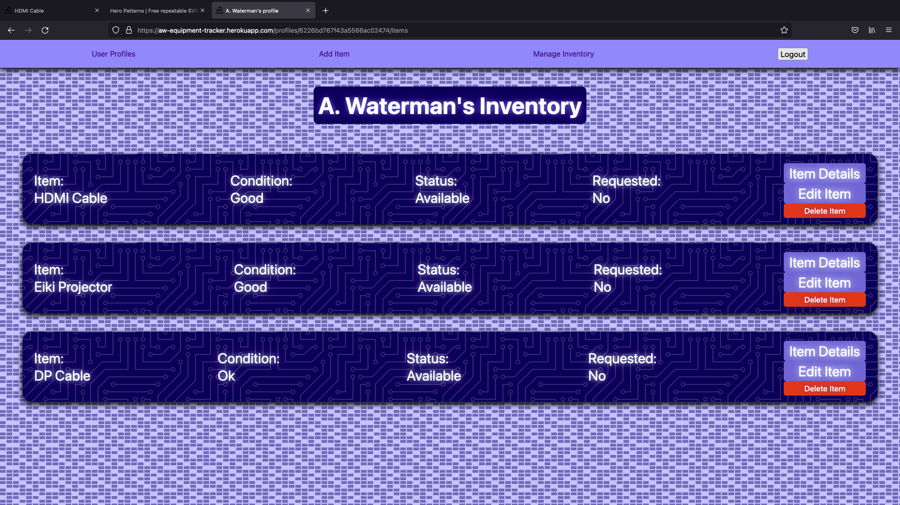
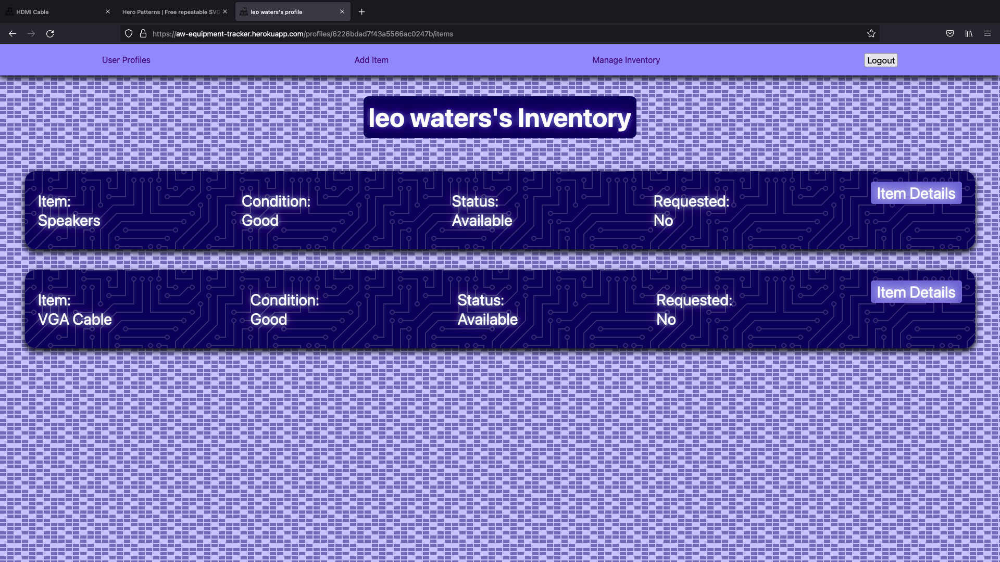
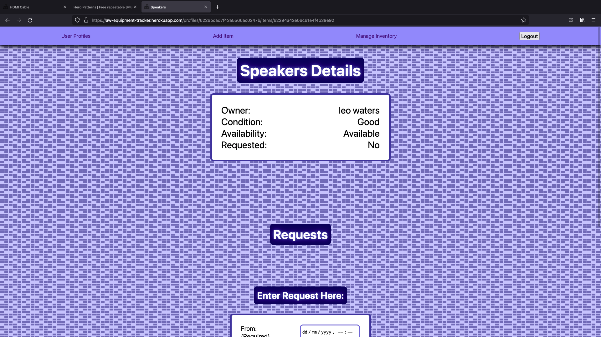
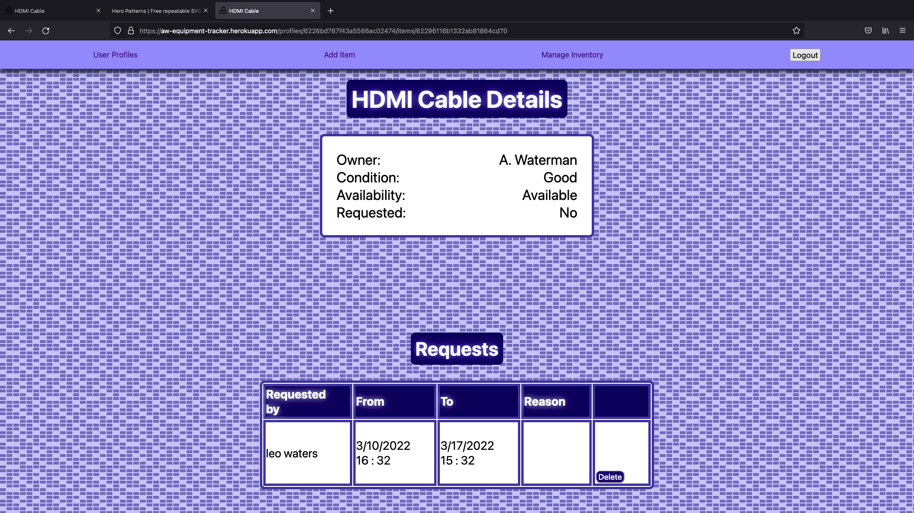
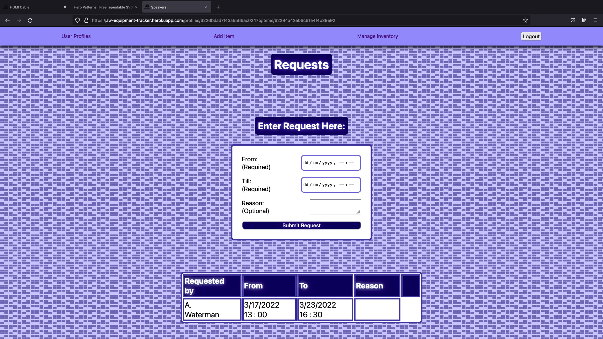

# Equipment Tracker
An app that currently allows people to request items to be borrowed.

Inspired by my time working as a college assistant at City College of New York

Initial planning done on [*trello*](https://trello.com/b/EBUVh0t0/equipment-tracker).

---

## Getting Started:

The app is deployed [*here*](https://aw-eqt-tracker.fly.dev/).

---
## Screenshots:
User Profiles

My Inventory

Another's Inventory

Item Details

Item Requests

Add Request

## Technologies Used:

---
## Planned Enhancements:

- Ideal date formatting
- Improve landing page
- Improve responsive design
- Render a warning page for deleting items
- Ability to upload item images
- Token based authentication
- Admin profiles for departments(Organize profiles by dept)
  
---

## Credits:
- [Skill badges found at dev.to](https://dev.to/envoy_/150-badges-for-github-pnk)

- <a href="https://www.flaticon.com/free-icons/inventory" title="inventory icons">Inventory icons created by Freepik - Flaticon</a>

- [Signal and CIrcuit Board background patterns courtesy of Steve Schoger](https://heropatterns.com/)